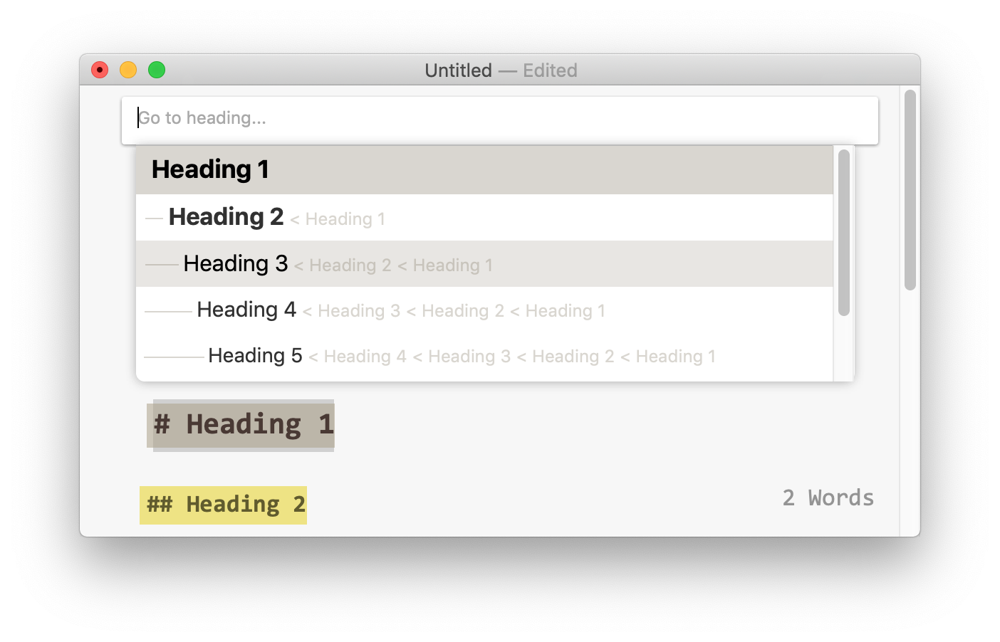
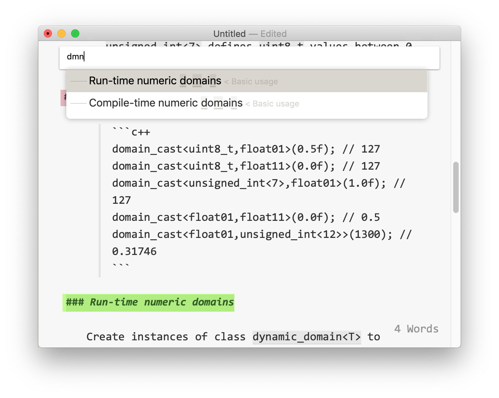

A "Go to..." Sublime-like fuzzy search bar plug-in for [FoldingText](https://www.foldingtext.com).

# Description

This plug-in adds a `Cmd+R` shortcut to FoldingText that behaves similarly to [Sublime Text](https://www.sublimetext.com)'s _Goto Symbol…_ command.

Upon activation, it displays a search bar with a list representing the structure of your document, selecting the nearest heading to the cursor.
The list can be navigated using the arrow keys, pressing `Return` closes the search bar and teleports you to the selected heading, and pressing `ESC` closes the search bar and teleports you back where you were before activating the command.
You can also scroll and click on the desired heading using the mouse.

To narrow down the structure, type a few characters belonging to the heading you're looking for.
This does a fuzzy search, presenting you the nearest matches first.

This allows you to quickly navigate to the previous or next heading (`Cmd+R`, then down arrow, then `Return`), or to quickly go anywhere in your document.

# Installation

 - Download this repository (_Clone or download_ > _Download ZIP_).
 - Open Folding Text, go to the application menu > _Plug-In Manager_
 - Click the _Open Plug-Ins Folder_ button
 - Put the `joinGoTo.ftplugin` directory from the downloaded zip into your FoldingText `Plug-Ins` folder
 - Restart FoldingText, and enjoy your new life with `Cmd+R`
